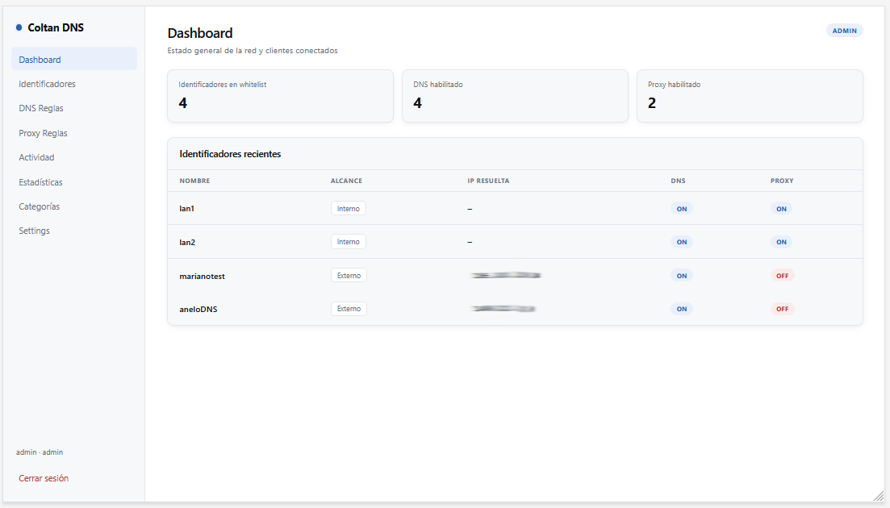
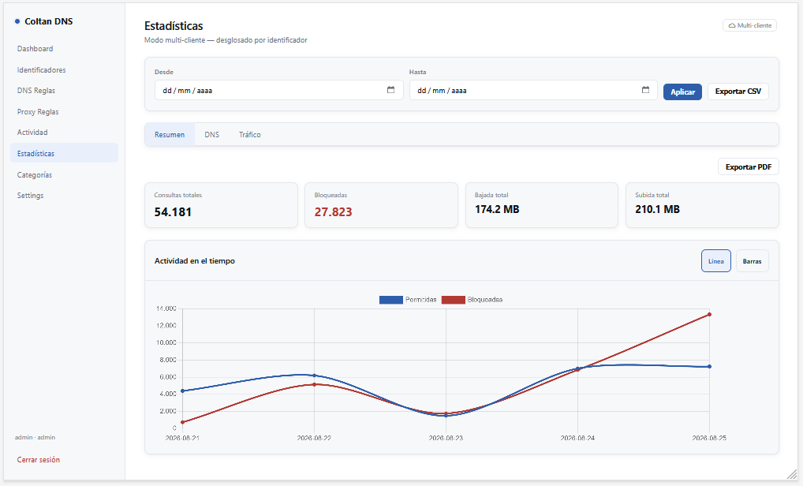
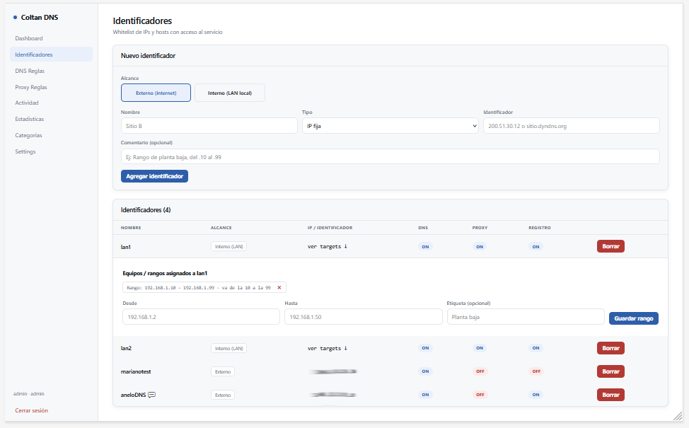
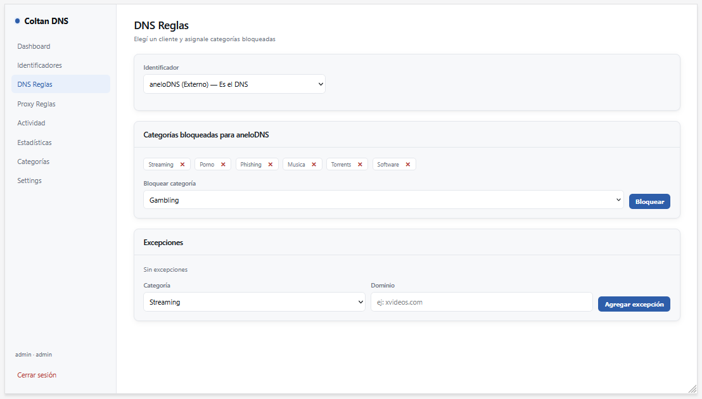
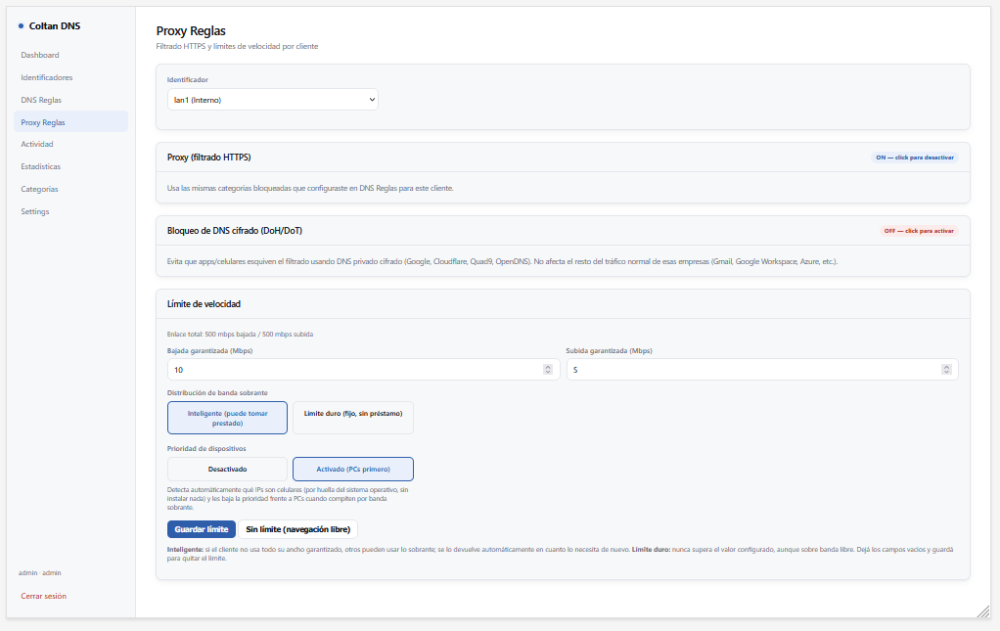
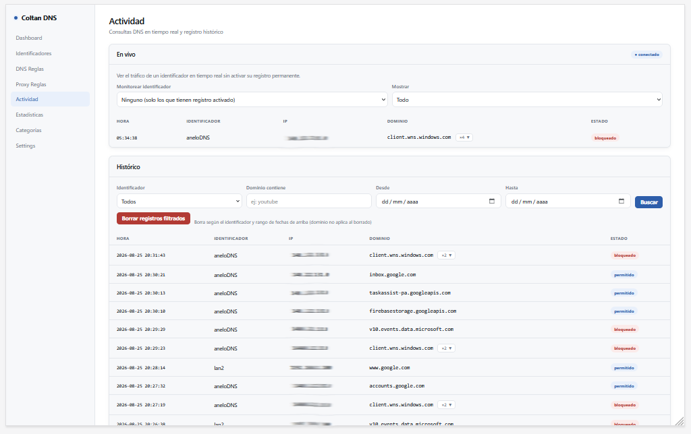
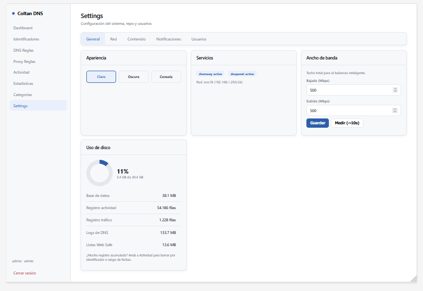
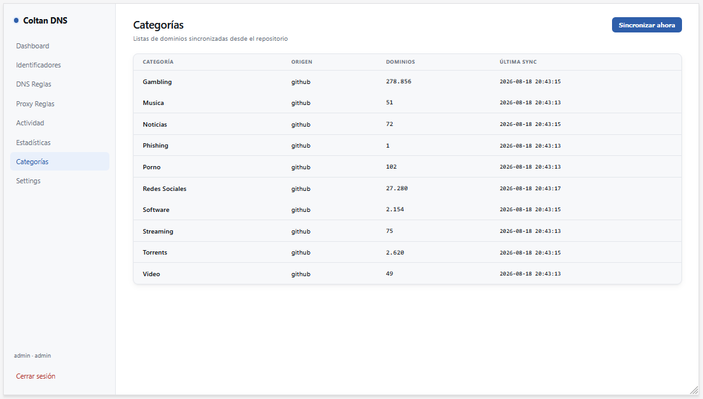
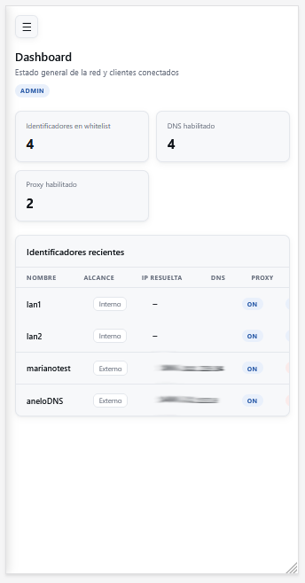

# Coltan DNS+Proxy Service

Sistema completo de filtrado DNS, proxy HTTPS por SNI, control de ancho de banda y seguridad de red, con panel de administración web. Pensado para correr en un servidor propio (VM Linux) y proteger tanto redes internas (LAN) como sitios remotos, sin depender de servicios de terceros.



## ¿Qué hace?

- **Filtrado DNS por categorías** (streaming, redes sociales, apuestas, adultos, torrents, etc.) con listas actualizables automáticamente desde un repositorio configurable.
- **Proxy HTTPS por SNI**, sin MITM ni certificados falsos: bloquea sitios a nivel de conexión sin descifrar el tráfico del usuario.
- **Web Safe**: bloqueo global de trackers y publicidad para toda la red, protegiendo cualquier dispositivo conectado (celulares, Smart TVs, consolas) sin instalar nada en ellos.
- **Bloqueo de DNS cifrado (DoH/DoT)**: evita que apps y dispositivos esquiven el filtrado usando resolutores DNS cifrados públicos.
- **Control de ancho de banda** con balanceo inteligente (los dispositivos comparten banda libre cuando no todos la están usando) y prioridad automática para PCs sobre celulares (detección pasiva de dispositivo, sin agentes instalados).
- **Modo interno y externo**: administra tanto redes LAN locales (por rango de IP, IP fija o MAC) como sitios remotos identificados por IP pública o DynDNS.
- **Actividad en tiempo real** y registro histórico (opcional, por identificador) con filtros, paginación y exportación a CSV/PDF.
- **Estadísticas** con gráficos (línea, barra, torta), detección automática de modo de uso (red interna vs. multi-cliente), y reportes automáticos por correo con rotación de logs.
- **Panel 100% responsive**, con tema claro/oscuro/consola, usable desde celular.
- **Configuración de red completa desde el panel** (IP, máscara, gateway, DNS upstream) — no hace falta tocar la terminal después de instalar.



## Requisitos

- **Debian 12** limpio, instalado como **máquina virtual** (no como contenedor LXC — el sistema usa `nftables`/`tc` a nivel de kernel para NAT y shaping de tráfico, que no funciona de forma confiable dentro de un LXC no privilegiado).
- Mínimo sugerido: 2 vCPU, 4GB RAM, 20GB de disco.
- Conexión a internet durante la instalación (descarga paquetes y dependencias).
- Acceso a consola o SSH como `root`.

## Instalación

> La instalación requiere una **clave de acceso**. El repositorio es público, pero el sistema en sí está cifrado (AES-256) y no se puede instalar sin la clave correspondiente. Contactanos si necesitás una.

```bash
git clone https://github.com/henrylandia/Server-DNSPROXY.git
cd Server-DNSPROXY
bash install.sh
```

El instalador va a pedirte la clave de acceso (no se muestra en pantalla al escribirla). Si es correcta, instala automáticamente todas las dependencias, arma la base de datos, y deja el sistema funcionando.

Al terminar, vas a ver algo así:

```
====================================================
 Instalación completa
====================================================

 Panel: http://<IP-del-servidor>:3030
 Usuario: admin
 Contraseña: coltan

 IMPORTANTE: cambiá la contraseña del admin y configurá
 la IP fija del servidor desde Settings → Red.
```


### Primeros pasos después de instalar

1. Entrá al panel con `admin` / `coltan` y **cambiá la contraseña**.
2. Andá a **Settings → Red** y configurá la IP fija, máscara y gateway según tu red real (por defecto usa la IP que te asignó DHCP).
3. Andá a **Settings → Contenido** y confirmá o cambiá la URL del repositorio de categorías, después tocá "Sincronizar ahora" para bajar las listas de dominios.
4. Creá tu primer identificador desde **Identificadores** (externo por IP/DynDNS, o interno por rango/IP/MAC de tu LAN).



## Desinstalar

```bash
bash uninstall.sh
```

Revierte todo lo que hizo el instalador (servicios, configuraciones, base de datos) y deja el servidor como estaba antes de instalar. No desinstala los paquetes del sistema (dnsmasq, Node, etc.), para que una reinstalación posterior sea más rápida.

## Capturas

| DNS Reglas | Proxy Reglas | Actividad |
|---|---|---|
|  |  |  |

| Settings | Categorías | Mobile |
|---|---|---|
|  |  |  |

## Arquitectura (resumen técnico)

- **dnsmasq**: motor de resolución/bloqueo DNS, una instancia aislada por identificador.
- **sniproxy**: filtrado de HTTPS por SNI, sin descifrar tráfico.
- **nftables**: redirección de tráfico por identificador y bloqueo de DNS cifrado.
- **tc (traffic control) + HTB**: shaping de ancho de banda con balanceo inteligente.
- **p0f**: detección pasiva de tipo de dispositivo (PC/celular) para priorización automática.
- **Node.js + Express + SQLite**: panel de administración y API.

## Licencia

Software propietario. El código de la aplicación está protegido; el instalador es de acceso público pero requiere clave de activación.
